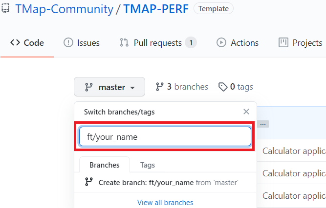
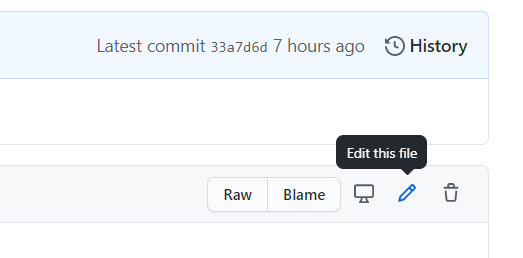
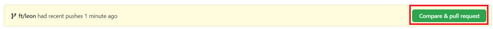

# Prerequisites

[github.com](https://www.github.com) acount. 

[](http://www.youtube.com/watch?v=az17G21pmQs "Create GitHub Account")


# Create pull request

1. Open the [repository](https://github.com/TMap-Community/TMAP-PERF/). 
2. Create a new branch by expanding the "master" dropdown. Change your_name in your actual name.



3. Create a new file named **multiply_service.py** within the src/service directory. By pressing **Add file**.
Use the following code as contents.

```python
def multiply(string):
    arguments = string.split("*")
    result = int(arguments[0]) * int(arguments[1])
    return result

```

Make sure you selected: **Commit directly to the ft/your_name** (your newly created branch name) and press commit changes. 

open [calculation_service.py]( https://github.com/TMap-Community/TMAP-PERF/blob/master/src/service/calculation_service.py)
and press the pensil to edit the file.


Change the contents to the following:

```python
"""Module for the CalculationService class"""
from tkinter import StringVar
import divide_service as divide_service
import multiply_service as multiply_service


class CalculationService:
    """""Class for keeping track of, and evaluating calculations"""""

    # Constructor for the class
    # Initializes a String expression and a StringVar equation
    # StringVar is used because it is required for the tkinter text box
    def __init__(self):
        print("initialized")
        self.expression = ""
        self.equation = StringVar()

    def press(self, num):
        """Function to update the expression in the text entry box"""
        # appends the new number to the existing expression
        self.expression = self.expression + str(num)

        # update the expression by using set method
        self.equation.set(self.expression)

    def equalpress(self):
        """Function to evaluate the final expression"""

        # using a try/except in order to catch errors
        try:

            # evaluate the expression/calculation
            if "/" in self.expression:
                total = str(divide_service.divide(self.expression))
            if "*" in self.expression:
                total = str(multiply_service.multiply(self.expression))
            else:
                total = str(eval(self.expression))
               

            if float(total) > 10:
                total = total + " <:o)"

            self.equation.set(total)

            # reset the expression to the empty string
            self.expression = ""

        # show error on the screen after an exception is caught
        except:
            self.equation.set(" error ")
            self.expression = ""


    def clear(self):
        """Function to clear the contents of text entry box"""
        self.expression = ""
        self.equation.set("")

    def get_expression(self):
        """get expression"""
        return self.expression

    def set_expression(self, newExpression):
        """set expression"""
        self.expression = newExpression

    def get_equation(self):
        """get equation"""
        return self.equation

    def set_equation(self, new_equation):
        """set equation"""
        self.equation.set(new_equation)

```

Make sure you selected: **Commit directly to the ft/your_name** (your newly created branch name) and press commit changes. 

4. Go to the [pull request overiew](https://github.com/TMap-Community/TMAP-PERF/pulls)
5. Press the **Compare & Pull Request** button 

6. In this overview you can write some details about the pull request or just press ***Create pull request*** to create the pull request.

8. You've succesful created a pull request to merge your code changes to the main branch.


# Review pull request

[](http://www.youtube.com/watch?v=JD5Mb9hltlw "Review pull request in GitHub")

1. Go to the [pull request overiew](https://github.com/TMap-Community/TMAP-PERF/pulls)
2. Go to the newly created pull request
3. Review the change using the following review template:
   - [ ] unit tests are written
   - [ ] code complies to the code style guide
     - [ ] public methods contain docstrings (comments starting with """)
     - [ ] method names are snake case (all lowercase with underscores between the words)
     - [ ] variables are snakecase
     - [ ] 